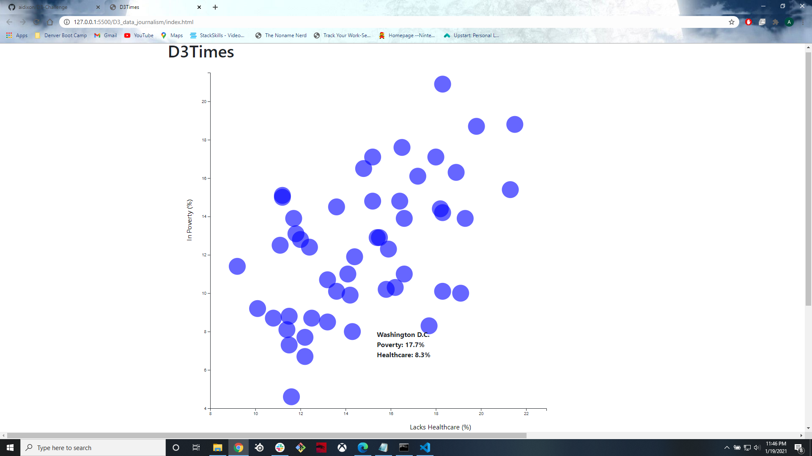

# D3-Challenge
The purpose of this challenge was to demonstrate the ability to utilize data driven documents (D3) and apply D3 to create interactive data visualization. 

The initial step was to create the margins of the chart and use d3.csv in order to read and analyze the csv file that was provided. The chart had to be transformed in order
to display the y-axis on the left and the x-axis on the bottom. Once the file was read, the data was parsed in order for the values to be read as integers that can be charted into circles on the chart.

Tooltip was used as an action to occur when the mouse hovers over the data and when the mouse moves off of the data point. The image is a sample of the final code.

